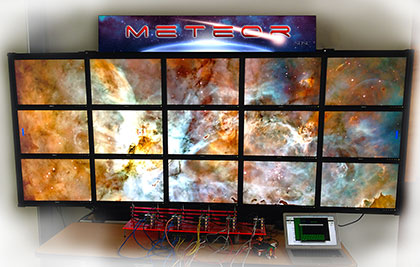

# SDSC Sandbox Raspberry Pi Cluster Guide

This is a guide to building Linux clusters for [Raspberry Pis](https://www.raspberrypi.org/). In the
workshop directory you'll find some background information on Linux
clusters and parallel computing along with the step-by-step
instructions on how to create a Raspberry Pi cluster. The config
directory has a script and configuration files that to help set up
the cluster. And the examples directory contains a growing number of
parallel applications for trying out and hacking.

This guide comes out of our experience with
[Meteor](http://www.sdsc.edu/News%20Items/PR111213_meteor.html), a
Raspberry Pi cluster driving a display wall with 15 Raspberry
Pi. We've used that to create video games for fun at several
[SC Conferences](http://supercomputing.org/) and [teach high school and
college students how to do parallel and distributed computing](https://www.nsf.gov/cise/csbytes/newsletter/vol3/pdf/csbb-vol3-i1.pdf). Coupling
the LCD panels to the Raspberry Pis makes a huge difference in helping
people new to parallel computing get a handle on "what's running
where". It also makes for a very engaging environment. You don't need
to do this for your cluster but if you want to this will help you
start.

Please contribute via issues or a pull request!
